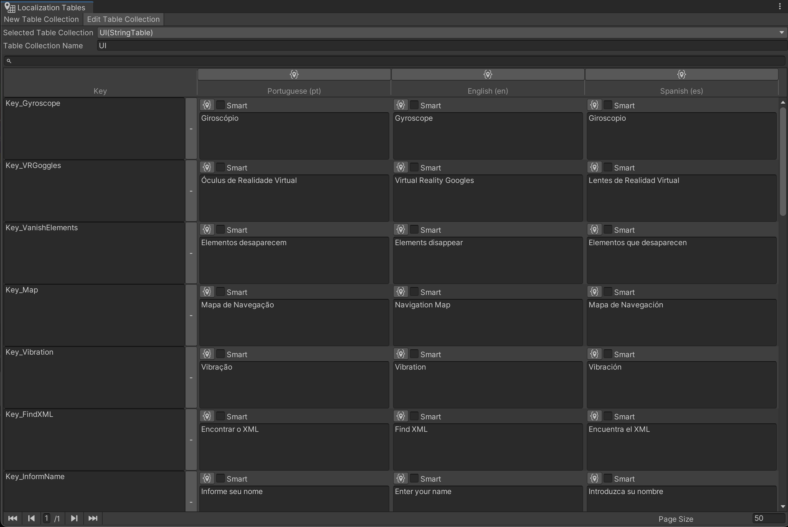

# Localização

Atualmente, o Player ENA possui suporte a 3 linguagens: Português, Inglês e Espanhol. O sistema de localização do aplicativo é feito através do pacote de localização da própria Unity, sendo escolhido por permitir a localização de strings e, caso necessário, assets. Esta seção focará no conteúdo já criado e como acessá-lo. Para mais detalhes sobre como usar o pacote, ver a documentação disponível [aqui](https://docs.unity3d.com/Packages/com.unity.localization@1.0/manual/index.html).

# Acessando as Tabelas

Para acessar as tabelas, basta ir em `Window → Asset Management → Localization Tables` e selecionar a tabela que deseja visualizar. Todas as tabelas criadas estão na pasta `Assets → _Project → Localization`.

Tabelas de Localização - UI

## Lista de Tabelas

- **Text-To-Speech:** Contém as mensagens faladas pelo leitor de voz durante a jogabilidade.
- **Object List:** Contém o nome dos objetos do jogo, usado para indicar com o que o jogador colidiu.
- **UI:** Contém o texto presente na interface gráfica.