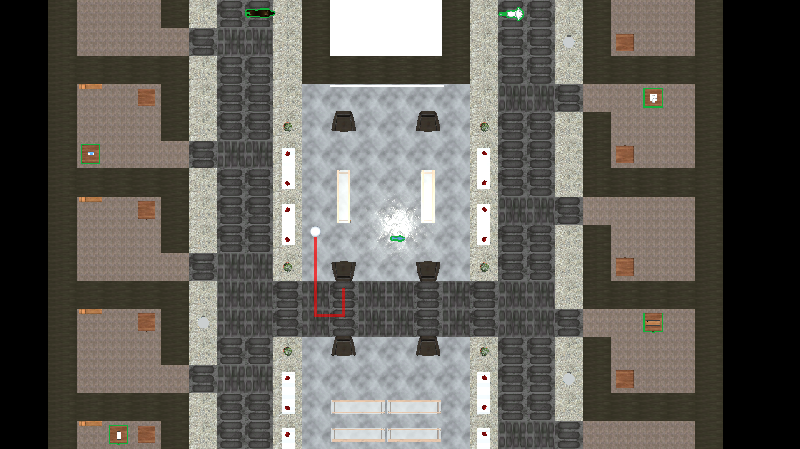

# Métricas

O Player ENA cria 2 artefatos para cada atividade realizada, permitindo ao professor de O&M acompanhar o progresso do aluno:

- Um **Minimapa** do ambiente da atividade
- Um Log do Jogador contendo os eventos que ocorreram durante a sessão

Ambos artefatos são encontrados dentro da subpasta `/logs` dentro da pasta de persistência da aplicação. Para mais informações sobre o local da pasta de persistência da aplicação, ver [`Application.persistentDataPath`](https://docs.unity3d.com/ScriptReference/Application-persistentDataPath.html).

## Minimapa

Além de fornecer uma visualização em tempo real para o professor de O&M, o mapa de jogo é salvo ao final da atividade para que seja possível visualizar o progresso de todos os objetivos, identificados com uma cor única para cada trajetória.

O nome do arquivo contém uma marcação contendo o nome do usuário e a data da imagem, enquanto a imagem em si contém o registro do mapa ao final da atividade, o leiaute do ambiente e os caminhos para cada objeto de jogo.



Exemplo de mapa salvo ao final da sessão

## Log do Jogador

O Log do jogador apresenta informações sobre a atividade realizada por um aluno armazenadas em um arquivo de texto

<aside>
⚠️ Indica campo sem valor definido ou que não está funcionando devidamente ainda.

</aside>

## Geral

| Parâmetro | Descrição | Tipo da Variável |
| --- | --- | --- |
| UserID ⚠️ | ID do usuário realizando a atividade | int |
| MapID ⚠️ | ID do mapa onde a atividade acontece | int |
| Date | Data e hora da atividade | DateTime |
| Completed | Indicador se o usuário completou a atividade | bool |
| TotalTime | Tempo total da atividade, medido em segundos | float |
| NumberOfCollisions | Número de colisões para toda a atividade | int |
| NumberOfRotations | Número de rotações realizadas para toda a atividade | int |
| NumberOfSteps | Número de passos andados para toda a atividade | int |
| Objectives | Lista de todos os objetivos alcançados | List<Objective> |

## Objetivos

| Parâmetro | Descrição | Tipo da Variável |
| --- | --- | --- |
| ObjectiveID ⚠️ | ID para o objeto que funciona como objetivo | int |
| TotalTime | Tempo total para alcançar o objetivo, medido em segundos | float |
| NumberOfCollisions | Número de colisões ocorridos durante a busca pelo objetivo | int |
| NumberOfRotations | Número de rotações realizadas durante a busca pelo objetivo | int |
| NumberOfSteps | Número de passos andados durante a busca pelo objetivo | int |
| Collisions | Lista de todas as colisões que ocorreram durante a busca pelo objetivo | List<Collision> |
| Actions | Lista de todas as ações realizadas pelo jogador para alcançar o objetivo | List<Action> |

## Colisões

| Parâmetro | Descrição | Tipo da Variável |
| --- | --- | --- |
| ObjectID | Identificador para o objeto com o qual foi colidido. | int |
| Timestamp | Estampa de tempo (em segundos) de quando a ação foi realizada. A estampa é relativa ao início da atividade. | float |
| Position | Local onde a ação foi realizada | Vector3 |

## Ações

| Parâmetro | Descrição | Tipo da Variável |
| --- | --- | --- |
| ActionID | Identificador para a ação que foi realizada: 0 → Andar, 1 → Girar | int |
| Direction | Direção seguida pelo jogador com a ação realizada | Direction |
| Timestamp | Estampa de tempo (em segundos) de quando a ação foi realizada. A estampa é relativa ao início da atividade. | float |
| Position | Local onde a ação foi realizada | Vector3 |

```
Resultado da Sessão
---
UserID: -1
MapID: -1
Date: 9/30/2022 10:29 AM
Completed: False
TotalTime: 34.05286 #seconds
NumberOfCollisions: 0
NumberOfRotations: 4
NumberOfSteps: 5
Objectives: 
  - TotalTime: 34.05286 #seconds
    NumberOfCollisions: 0
    NumberOfRotations: 4
    NumberOfSteps: 5
    Collisions: 
			- ObjectID: 5 #Chair
				Time: 9 #seconds
				Position: {x: 8, y: 5, z: 0}
    Actions: 
      - ActionID: 1 #Turn
        Direction: Left
        Time: 14.39899 #seconds
        Position: {x: 10, y: 0.94, z: 8.25}
      - ActionID: 0 #Walk
        Direction: Down
        Time: 16.82821 #seconds
        Position: {x: 10, y: 0.94, z: 7.25}
      - ActionID: 1 #Turn
        Direction: Right
        Time: 18.50635 #seconds
        Position: {x: 10, y: 0.94, z: 7.25}
      - ActionID: 0 #Walk
        Direction: Left
        Time: 21.20821 #seconds
        Position: {x: 9, y: 0.94, z: 7.25}
      - ActionID: 1 #Turn
        Direction: Right
        Time: 28.478 #seconds
        Position: {x: 9, y: 0.94, z: 7.25}
      - ActionID: 0 #Walk
        Direction: Up
        Time: 31.00821 #seconds
        Position: {x: 9, y: 0.94, z: 8.25}
      - ActionID: 0 #Walk
        Direction: Up
        Time: 32.56821 #seconds
        Position: {x: 9, y: 0.94, z: 9.25}
      - ActionID: 0 #Walk
        Direction: Up
        Time: 33.56821 #seconds
        Position: {x: 9, y: 0.94, z: 10.25}
      - ActionID: 1 #Turn
        Direction: Left
        Time: 34.05286 #seconds
        Position: {x: 9, y: 0.94, z: 10.25}
```
Exemplo de Log gerado pela aplicação