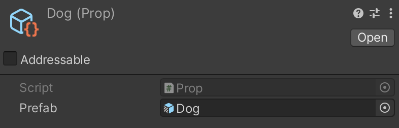
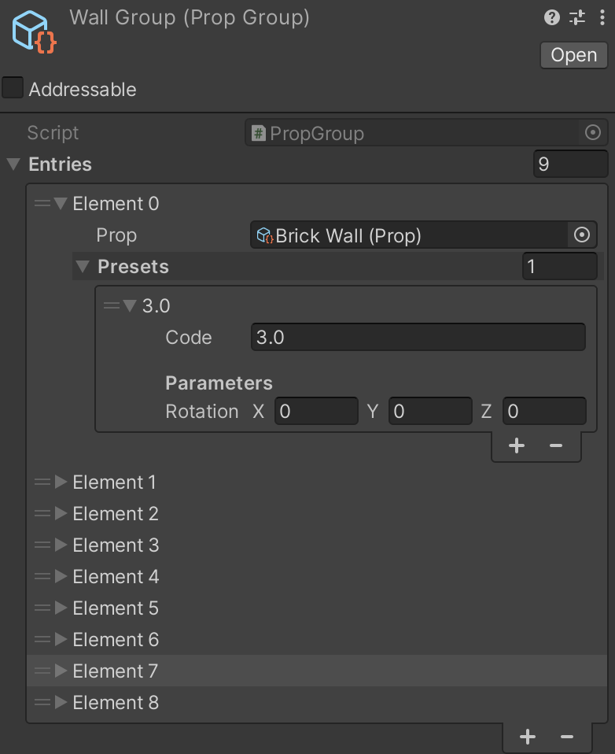
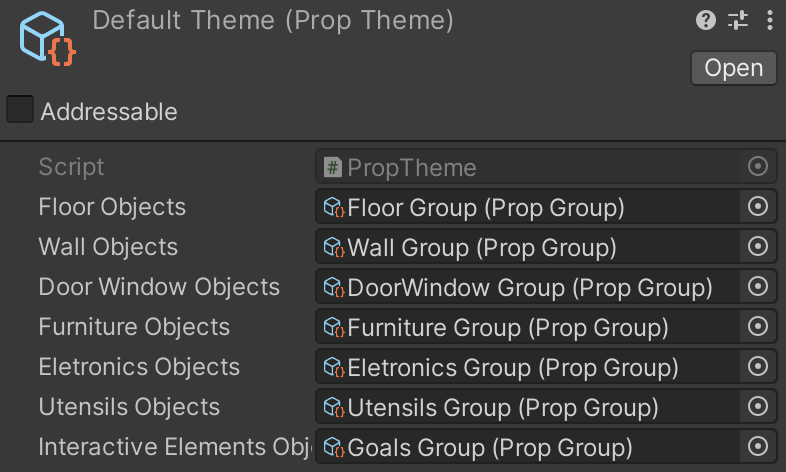
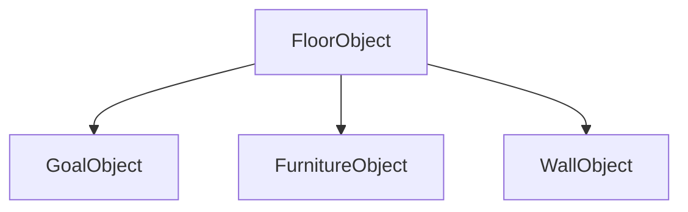

# Props

Props são os elementos comuns usados na construção dos mapas para o Player ENA.

# Arquitetura dos Prefabs

## Modelo

<aside>
ℹ️ Create → ENA → Prop Model

</aside>

Referência básica usada para um objeto a ser criado no mapa de jogo, definindo qual Prefab será usado para o Prop. Foi projetado para que mudanças de representação sejam feitas simplesmente alterando o prefab usado no prop.

Modelo de Prop

## Grupo

<aside>
ℹ️ Create → ENA → Prop Group

</aside>

Conjunto de Props disponíveis para representar uma camada do mapa de jogo. Aqui você pode associar um prop a um ou mais códigos de jogo, ajustando os parâmetros de inicialização para cada caso (por agora, apenas a rotação pode ser alterada).

Grupo de Props

## Tema

<aside>
ℹ️ Create → ENA → Prop Theme

</aside>

Elemento responsável por definir a representação geral do mapa, permitindo associar um Prop Group para cada camada. O tema é usado pelo Map Creator para, com base nos códigos de objeto do mapa, fornecer os prefabs necessários para sua construção.

Tema de Mapa

# Estrutura do Prefab

Todos os props estão organizados na seguinte hierarquia de prefabs:

- **Floor Object** contêm a estrutura base para todos os objetos presentes no cenário, sendo composto por um cubo de referência para posicionamento dos modelos de cada objeto e uma fonte de áudio conectada a um componente Pressure Plate para tocar um som de colisão toda vez que o jogador colidir com o objeto. Usado na construção dos prefabs de pisos e de outros templates de prefab.
- **Furniture Object** é uma variante de Floor Object usado para criar outros objetos de mobília interativos. a principal mudança está na adição de um `CollidableProp` para para indicar qual foi o objeto com o qual colidiu.
- **Wall Object** é uma variante de Floor Object usado para criar paredes. Além de também ter um `CollidableProp`, o cubo de referência tem suas proporções ajustadas para lidar com paredes.
- **Goal Object** é uma variante de Floor Object usado para a criação de objetivos de jogo. Além de ajustar a caixa de colisão e o mixer do áudio para o canal Resonance, adiciona dois componentes novos: `CollidableProp` e Outline, sendo este último usado para contornar os objetos usando um Line Renderer.
- **Door Object** é uma variante de Wall Object usado para a construção de prefabs de porta. Além de adicionar um modelo de porta e o componente `CollidableProp`, possui um script próprio chamado `MoveDoor` para definir sua capacidade de interação.

<aside>
ℹ️ Todos os props usados no ENA foram construídos usando o seguinte fluxo:

1. Criação de um novo prefab com base em um dos templates acima
2. Adição de modelos e componentes exclusivos
3. Criação de um registro de Prop e associação do prefab
4. Adição do registro a um Prop Group desejado, definido presets contendo o código do objeto a ser usado e os parâmetros de inicialização
</aside>

# Lista de Props

<aside>
ℹ️ Todos os prefabs abaixo estão disponíveis na pasta "_Project/Props” e podem ser visualizados na cena "_Editor/PrefabCreator”

</aside>

<aside>
ℹ️ O campo “Código de Objeto”, os itens em parentêses são códigos para as partes complementares ao código do pivô, sendo apenas ele responsável por determinar a posição de instânciamento do objeto.

</aside>

| Objeto | Categoria/Camada | Código do Objeto | Tamanho (WxH) |
| --- | --- | --- | --- |
| Piso de Cimento | Floor | 0.0 | 1x1 |
| Piso de Paralelepípedo | Floor | 0.1 | 1x1 |
| Piso de Carpete | Floor | 1.0 | 1x1 |
| Piso Metálico | Floor | 1.1 | 1x1 |
| Piso de Água | Floor | 2.0 | 1x1 |
| Chão com Folhas Secas | Floor | 2.1 | 1x1 |
| Piso de Cerâmica | Floor | 3.0 | 1x1 |
| Piso de Grama | Floor | 3.1 | 1x1 |
| Piso de Areia | Floor | 4.0 | 1x1 |
| Piso de Madeira | Floor | 4.1 | 1x1 |
| Piso Tátil de Atenção
(borracha) | Floor | 5.0 | 1x1 |
| Piso de Neve | Floor | 5.1 | 1x1 |
| Piso Tátil de Direção
(borracha) | Floor | 6.0 | 1x1 |
| Piso de Vidro | Floor | 6.1 | 1x1 |
| Piso de Cascalho | Floor | 7.0 | 1x1 |
| Piso de Pedra | Floor | 7.1 | 1x1 |
| Guarda Corpo (meia-parede) | Wall | 0.0 | 1x1 |
| Parede de Azulejo | Wall | 1.0 | 1x1 |
| Parede de Madeira | Wall | 2.0 | 1x1 |
| Parede de Tijolo | Wall | 3.0 | 1x1 |
| Parede de Vidro | Wall | 4.0 | 1x1 |
| Parede de Plástico | Wall | 5.0 | 1x1 |
| Parede de Gesso | Wall | 6.0 | 1x1 |
| Parede Genérica | Wall | 7.0 | 1x1 |
| Escada | Wall | 0.1 (1.1), 1.2 (0.2), 2.2 (2.1), 3.1 (3.2) | 2x1 |
| Porta Trancada | Door | 0.0 (1.0), 0.2 (0.1) | 2x1 |
| Porta Fechada | Door | 2.0 (3.0), 2.2 (2.1) | 2x1 |
| Porta Aberta | Door | 4.0 (5.0), 4.2 (4.1) | 2x1 |
| Janela de Vidro | Window | 6.0, 6.1 | 1x1 |
| Janela de Madeira | Window | 7.0, 7.1 | 1x1 |
| Cama de Casal | Furniture | 1.1 (0.0, 0.1, 1.0), 2.0 (2.1, 3.0, 3.1), 5.0 (4.0, 4.1, 5.1), 6.1 (6.0, 7.0, 7.1) | 2x2 |
| Cama de Solteiro | Furniture | 0.3 (0.2), 1.2 (1.3), 2.3 (3.3), 3.2 (2.2) | 2x1 |
| Poltrona | Furniture | 4.2, 4.3, 5.2, 5.3 | 1x1 |
| Cadeira | Furniture | 6.2, 6.3, 7.2, 7.3 | 1x1 |
| Mesa de Jantar (c/ 4 cadeiras) | Furniture | 0.4 (0.5, 1.4, 1.5), 3.5 (2.4, 2.5, 3.4) | 2x2 |
| Guarda-Roupa | Furniture | 4.5 (4.4, 5.4, 5.5), 5.6 (4.6, 4.7, 5.7), 6.4 (6.5, 7.4, 7.5), 6.7 (6.6, 7.6, 7.7) | 2x1 (2x2) |
| Armário de Ferro | Furniture | 0.7 (0.6, 1.6, 1.7), 0.8 (0.9, 1.8, 1.9), 3.6 (2.6, 2.7, 3.7), 3.9 (2.8, 2.9, 3.8) | 2x1 (2x2) |
| Sofá | Furniture | 4.9 (4.8), 4.10 (5.10), 5.8 (5.9), 5.11 (4.11) | 2x1 |
| Cômoda | Furniture | 0.10, 0.11, 1.10, 1.11 | 1x1 |
| Estante | Furniture | 6.11 (6.10), 7.10 (7.11), 7.12 (6.12), 6.13 (7.13) | 1x1 (1x2) |
| Mesa | Furniture | 0.12 (0.13), 1.12 (2.12) | 2x1 |
| Criado Mudo | Furniture | 6.8, 6.9, 7.8, 7.9 | 1x1 |
| Fogão | Eletronic | 2.0, 2.1, 3.0, 3.1 | 1x1 |
| Geladeira | Eletronic | 0.1 (0.0), 0.3 (1.3), 1.1 (1,0), 1.2 (0.2), | 1x1 (1x2) |
| Computador | Eletronic | 4.0, 4.1, 5.0, 5.1 | 1x1 |
| Máquina de Lavar | Eletronic | 6.0, 6.1, 7.0, 7.1 | 1x1 |
| TV | Eletronic | 2.2, 2.3, 3.2, 3.3 | 1x1 |
| Microondas | Eletronic | 4.2, 4.3, 5.2, 5.3 | 1x1 |
| Copiadora | Eletronic | 6.3 (6.2) | 1x1 (1x2) |
| Piano | Utensils | 1.1 (0.0, 0.1, 1.0), 1.2 (0.2, 0.3, 1.3) | 2x2 |
| Cone | Utensils | 2.0 | 1x1 |
| Lâmpada | Utensils | 3.0 | 1x1 |
| Violão | Utensils | 2.1 | 1x1 |
| Lixeira | Utensils | 3.1 | 1x1 |
| Vaso Sanitário | Utensils | 4.0, 4.1, 5.0, 5.1 | 1x1 |
| Lavatório | Utensils | 6.0, 6.1, 7.0, 7.1 | 1x1 |
| Planta | Utensils | 2.3 (2.2) | 1x1 (1x2) |
| Quadro de Pintura | Utensils | 3.2, 3.3, 4.2, 4.3 | 1x1 |
| Cachorro | Goals | 0.0, 0.1, 1.0, 1.1 | 1x1 |
| Inseto | Goals | 2.0, 2.1, 3.0, 3.1 | 1x1 |
| Pássaro | Goals | 4.0, 4.1, 5.0, 5.1 | 1x1 |
| Gato | Goals | 6.0, 6.1, 7.0, 7.1 | 1x1 |
| Sapo | Goals | 0.2, 0.3, 1.2, 1.3 | 1x1 |
| Secador de Cabelo | Goals | 2.2 | 1x1 |
| Liquidificador | Goals | 3.2 | 1x1 |
| Chaleira | Goals | 4.2 | 1x1 |
| Impressora | Goals | 5.2 | 1x1 |
| Celular | Goals | 6.2 | 1x1 |
| Criança | Goals | 7.2 | 1x1 |
| Rádio | Goals | 2.3 | 1x1 |
| Despertador | Goals | 3.3 | 1x1 |
| Batedeira | Goals | 4.3 | 1x1 |
| Ventilador | Goals | 5.3 | 1x1 |
| Jogador | Player | 3.0 | 1x1 |