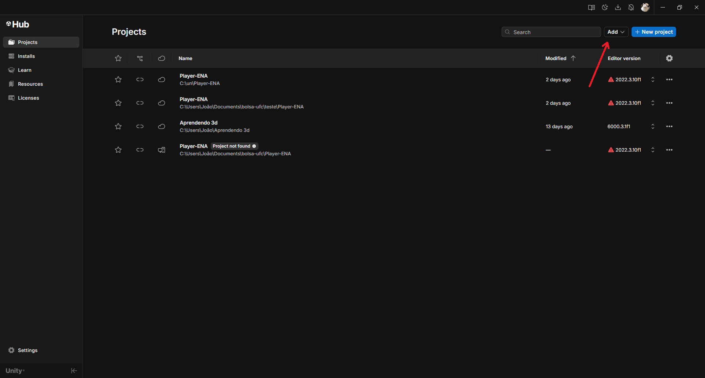
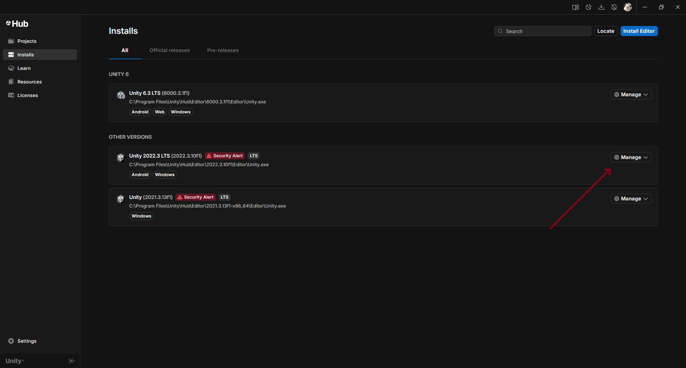
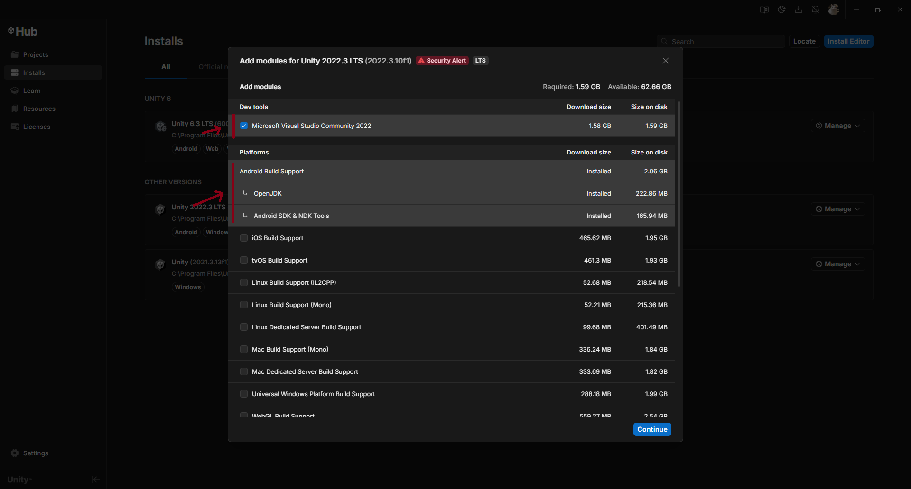
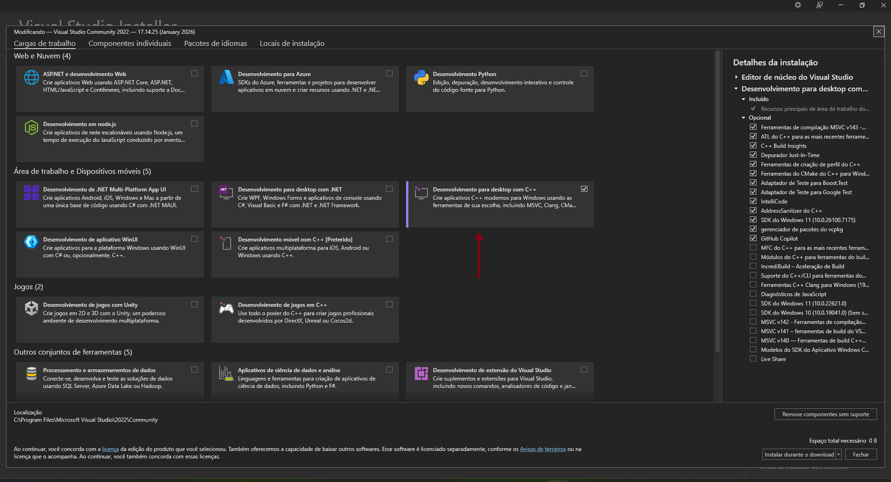
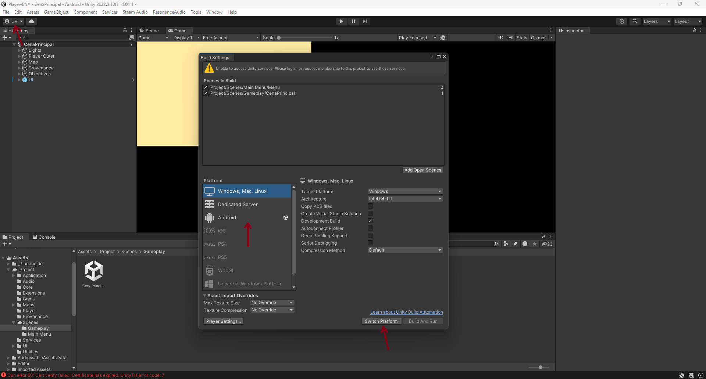
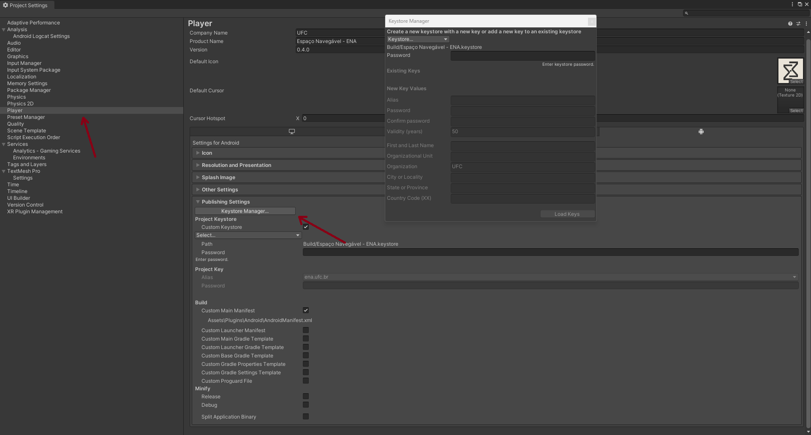
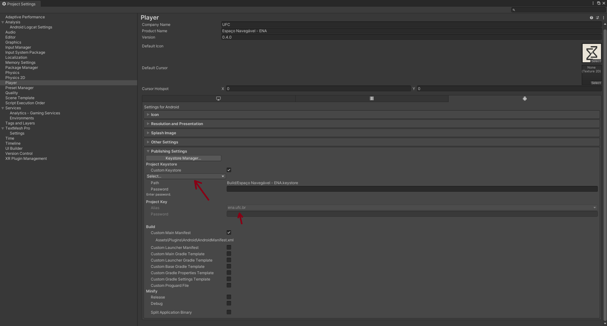
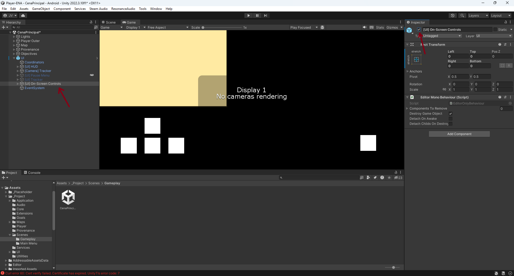

# Player-ENA

## Requisitos para rodar o projeto

Para executar o projeto corretamente, é necessário ter as seguintes ferramentas instaladas:

* Git
* Unity Hub

## Clonando o repositório

**Atenção:** não clone o projeto em um caminho de diretório que contenha acentos ou caracteres especiais.
Durante o processo de build para Android, a presença de caracteres não ASCII pode causar erro e impedir a build.

Após escolher um diretório adequado, clone o repositório utilizando o comando abaixo:

```bash
git clone https://github.com/Project-OMA/Player-ENA.git
```

Após clonar o projeto, lembre-se de mudar para a **branch correspondente à versão que deseja testar**.
Caso contrário, o projeto será aberto em uma versão desatualizada no Unity.

## Configurando o projeto no Unity

1. Abra o **Unity Hub**.
2.  Na aba **Projects**, clique em **Add** e selecione a pasta raiz do projeto para importá-lo ao Unity Hub.
3. Durante a importação, o Unity solicitará a instalação da versão do editor utilizada pelo projeto.
   Ignore o aviso em vermelho de *security alert*, pois trata-se apenas de uma recomendação relacionada à versão do editor.
4. Após instalar o editor, vá até a aba **Installs** no Unity Hub.
5. Selecione a opção **Manage** na versão do editor recém-instalada.
6. Clique em **Add modules** e selecione os módulos necessários para exportação para **Android**.







## Instalando DLLs e pacotes faltantes

Após configurar o Unity e instalar o Visual Studio:

1. Procure por **Visual Studio Installer** no sistema operacional.
2. Abra o instalador e selecione a opção **Modificar** na versão do Visual Studio instalada pelo Unity.
3. Na nova janela, instale a opção:

    * **Desenvolvimento para desktop com C++**

Também verifique se as seguintes versões do **Microsoft Visual C++ Redistributable** estão instaladas no sistema:

- Microsoft Visual C++ 2015–2022 Redistributable (x64)
- Microsoft Visual C++ 2015–2022 Redistributable (x86)

Caso não estejam instaladas, faça o download diretamente pelo site oficial da Microsoft.



## Build do projeto para Android

1. Com o projeto aberto no Unity, vá em:

   ```
   File > Build Settings
   ```
2. Selecione **Android** e clique em **Switch Platform**.
3. Ainda nessa aba, clique em **Player Settings**.
4. Vá até **Publish Settings** e abra o **Keystore Manager**.

5. Crie uma nova chave seguindo o padrão de nomenclatura desejado.
6. Após concluir, selecione o **Custom Keystore** criado.
7. Escolha o **Alias** correspondente na seção **Project Key**.
8. Volte para a aba **Build Settings** e gere o APK em um diretório de sua preferência.







## Instalando o APK no smartphone

1. Transfira o APK para o smartphone Android.
2. Habilite o **modo desenvolvedor**.
3. Permita a execução de **aplicativos externos**.
4. Abra o aplicativo.

Caso ocorra algum erro, revise as etapas anteriores.

## Importando mapas para dentro do APK

No smartphone Android, copie os arquivos de mapa para o seguinte diretório:

```
Armazenamento interno/Android/data/com.ufc.ena/files/resources/maps
```

Ao reabrir o aplicativo, os mapas deverão ser carregados automaticamente.

## Testes sem joystick físico

Caso não possua um joystick físico, habilite a opção ***[UI] On-Screen Controls***:



## Testes diretamente no Unity

Para testes diretamente no editor, copie os mapas para o diretório:

```
AppData\LocalLow\UFC\Espaço Navegável - ENA\resources\maps
```
## Pasta Logs

Na pasta **Logs** estão armazenados os arquivos gerados a cada sessão de jogo.

Ela contém:

- **Uma imagem**: representa graficamente o percurso realizado pelo jogador durante a partida.
- **Um arquivo JSON**: contém informações detalhadas da sessão, como tempo de jogo, número de colisões, mapa utilizado e outros dados relevantes.

> **Observação:** Os logs são gerados apenas para partidas em que todos os objetivos do jogo são concluídos.

### Localização da pasta

Os arquivos podem ser encontrados no seguinte caminho:

```
AppData\LocalLow\UFC\Espaço Navegável - ENA\logs
```